# 绿联NAS部署OpenClaw保姆级教程：打造飞书AI机器人 - 深度优化版

## 前言

如果你想在飞书里拥有一个属于自己的AI机器人，[OpenClaw](https://mp.weixin.qq.com/s/KjCq0sJpChyThlRZKrz2VA)是一个很不错的选择。它是一个强大的AI工具代理网关，支持多种IM平台接入，并且集成了代码助手、浏览器自动化等实用功能。

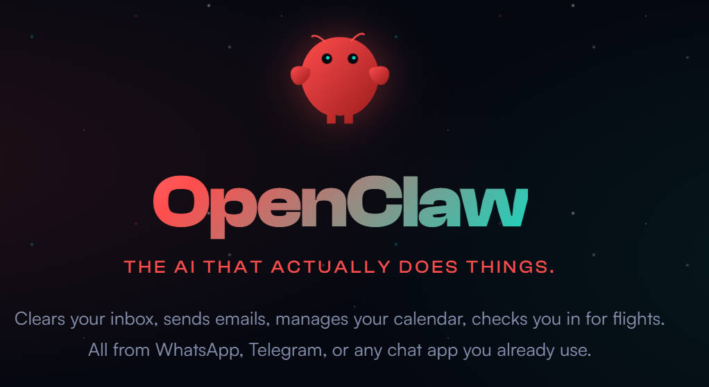

**本教程将手把手教你**如何在**绿联NAS**上部署OpenClaw，并对接飞书，使用SiliconFlow提供的LLM API服务。

> 💡 **推荐模型提供商**：本教程使用 [SiliconFlow](https://cloud.siliconflow.cn/i/ym4c1Vqm) 的API服务。注册后可获得赠金额度，支持多种大模型，性价比很高！扫下面⬇️的二维码注册！**本教程会用到！**


>  💡 **推荐模型提供商**：[白山智算](https://ai.baishan.com/auth/login?referralCode=XfApeVpYoN)，实名注册送150元，首次API调用送200元，福利政策有效期将延续至**2026年3月15日24时**。扫下面⬇️的二维码注册！**本教程会用到！**

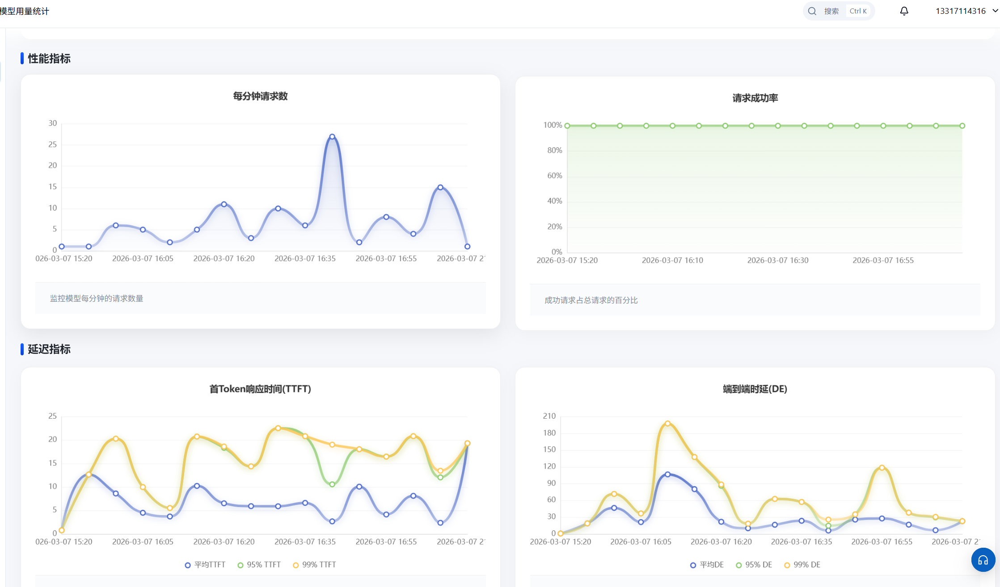

---

## 一、OpenClaw是什么？

[OpenClaw](https://docs.openclaw.ai/)是一个开源的AI工具调度代理网关，专注于将各种AI能力（如大模型、代码助手、浏览器自动化等）通过统一的接口对外提供服务。

本教程使用的是预装了中国主流IM平台的定制Docker镜像 [**OpenClaw-Docker-CN-IM**](https://github.com/justlovemaki/OpenClaw-Docker-CN-IM)，其特性如下：

> 鉴于上游版本对模型名称有多个斜杠`/`处理不好，上个教程发出去以后，反馈难度太大，我修复了一下，维护了一个[自己的版本](https://github.com/aichipera/OpenClaw-Docker-CN-IM), 并给上游发了[Pull Request](https://github.com/justlovemaki/OpenClaw-Docker-CN-IM/pull/87)。

| 特性              | 说明                             |
| --------------- | ------------------------------ |
| 🚀 **开箱即用**     | **飞书、钉钉、QQ、企业微信**等主流IM平台插件全部预装 |
| 🐳 **Docker部署** | 一键启动，无需复杂配置                    |
| 💻 **AI代码助手**   | 内置OpenCode AI，支持智能代码生成和分析      |
| 🎭 **浏览器自动化**   | 预装Playwright，支持网页操作和截图         |
| 🎙️ **中文TTS**   | 支持中文语音合成                       |

如果觉得这个Docker项目不错，建议可以**打赏项目原作者**，这里附上他项目的微信打赏二维码（可自行访问原项目的链接 https://github.com/justlovemaki/OpenClaw-Docker-CN-IM 核查）：


---

## 二、准备工作

> [!NOTE]
> 温馨提示：鉴于很多用户可能是技术小白，建议完全按照教程复刻。

### 2.1 硬件要求

- 一台已联网的**绿联NAS**（需要支持Docker的型号）
- 绿联NAS管理员权限

### 2.2 申请API Key

> [!NOTE]
> **温馨提示**：现在**国内平台**基本都要求**实名注册**才能使用大模型API调用功能。

1. **绿联NAS** 且 使能 **Docker 功能**

2. **注册SiliconFlow**账号获取API Key
   - 访问 [https://cloud.siliconflow.cn/i/ym4c1Vqm](https://cloud.siliconflow.cn/i/ym4c1Vqm) 注册
   - 完成实名认证后可获得赠金额度

**实名注册**完成后，建议**务必充值几块钱**(下面是平台政策说明)，然后创建**API Key**： https://cloud.siliconflow.cn/me/account/ak 

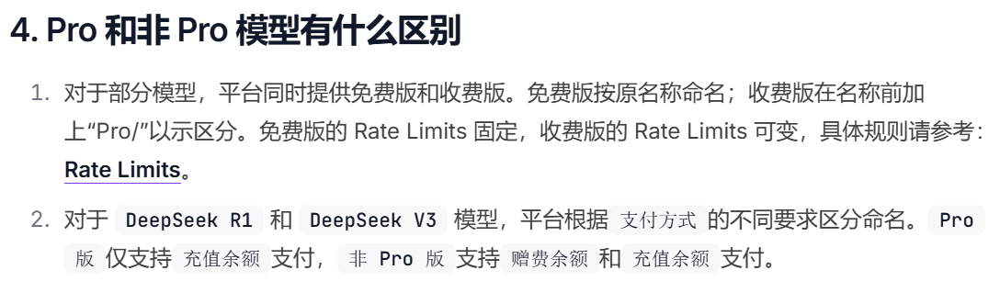

> 需要注意OpenClaw本身需要消耗大模型Token，这个会产生费用，详细计费情况（登录后）请参见 https://cloud.siliconflow.cn/me/bills

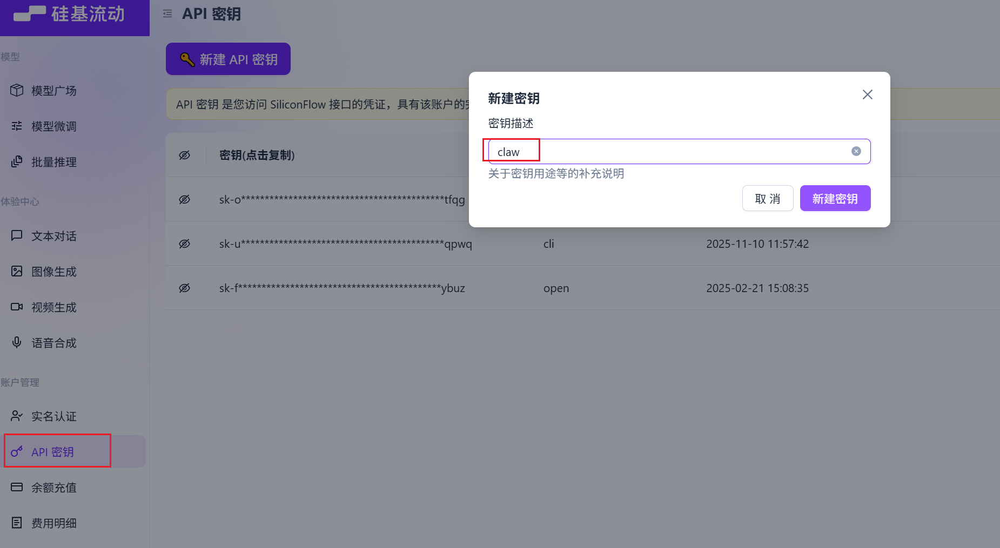

创建成功后，把API Key复制下来，记录为 `API_KEY` 变量的值，后面要用到。

3. 注册 **白山智算** 账号，实名注册后会赠送 150 元，完成API调用以后赠送 200 元，限时到 3.15号。完成**实名注册**后，访问 https://ai.baishan.com/key/index 设置API秘钥

点击确认后**创建密钥**，注意复制以后保存下, 这里记为 `BAISHAN_API_KEY`，就不会再出现，如果不小心忘了，可以重新创建一个。
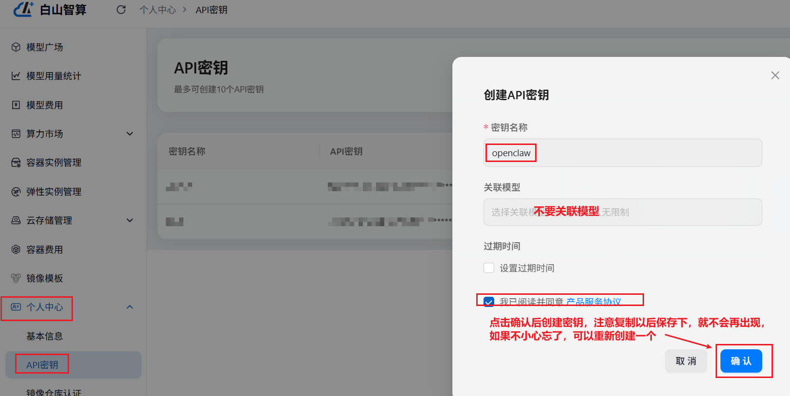

### 2.3 飞书机器人

1. 访问 [飞书开放平台](https://open.feishu.cn)
2. 点击「创建企业自建应用」
3. 填写应用名称（如「AI助手」）
4. 选择应用类型为「机器人」

> [!NOTE]
> OpenClaw官方的feishu插件也提供了[注册教程](https://github.com/openclaw/openclaw/blob/main/docs/channels/feishu.md)，也可以参考。下面的教程是本人实操记录。

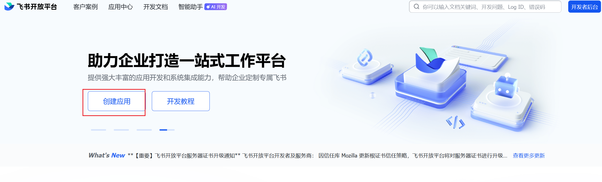
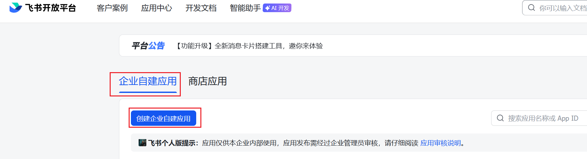
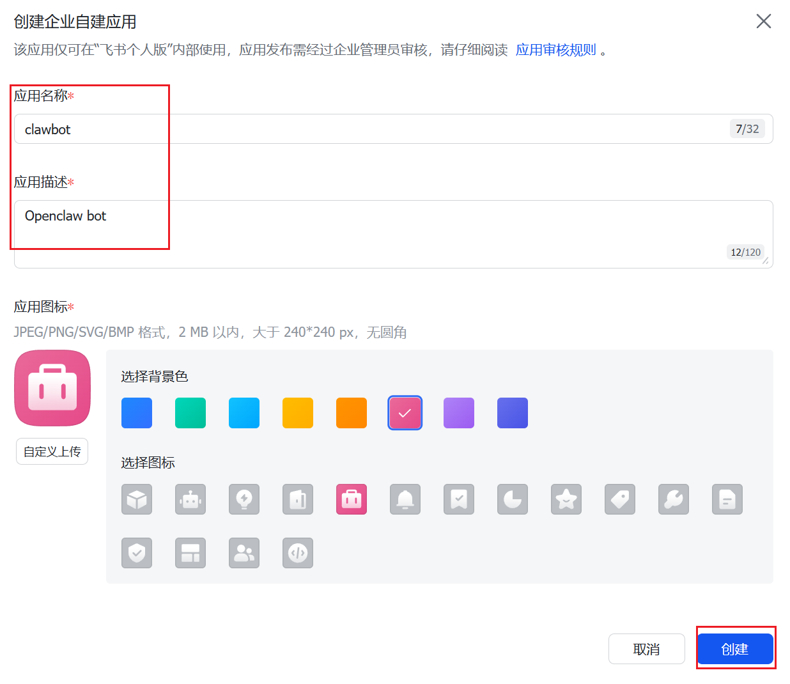
在 **机器人** 页面，修改这里的 **如何开始使用**
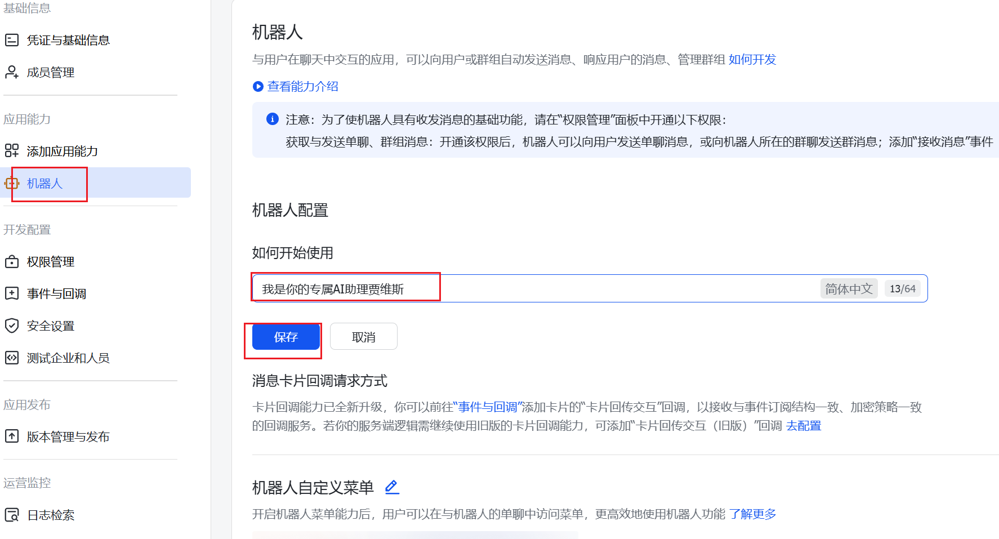
在 **凭证与基础信息** 这里 点击一下，然后复制记住这里的 **App ID** 和 **App Secret** ，这是**非常重要**的。 这里记录为 `FEISHU_APP_ID` 和 `FEISHU_APP_SECRET` 变量的值。
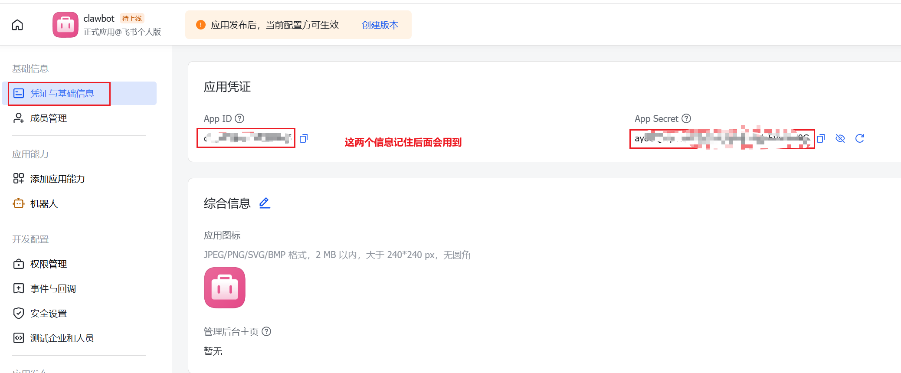

然后点击「**权限管理**」，点击「**批量导入/导出权限**」，复制下面的**JSON内容**粘贴导入：

~~~json
{
  "scopes": {
    "tenant": [
      "aily:file:read",
      "aily:file:write",
      "application:application.app_message_stats.overview:readonly",
      "application:application:self_manage",
      "application:bot.menu:write",
      "cardkit:card:read",
      "cardkit:card:write",
      "contact:contact.base:readonly",
      "contact:user.employee_id:readonly",
      "corehr:file:download",
      "event:ip_list",
      "im:chat.access_event.bot_p2p_chat:read",
      "im:chat.members:bot_access",
      "im:message",
      "im:message.group_at_msg:readonly",
      "im:message.p2p_msg:readonly",
      "im:message:readonly",
      "im:message:send_as_bot",
      "im:resource"
    ],
    "user": [
      "aily:file:read",
      "aily:file:write",
      "im:chat.access_event.bot_p2p_chat:read"
    ]
  }
}
~~~

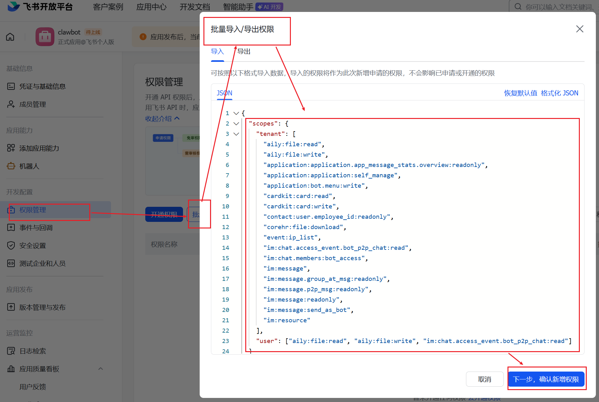
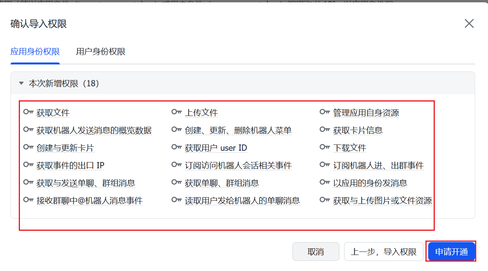

然后**创建机器人**，发布一个版本，版本号填写「**1.0.0**」，更新记录可以随意填写，**务必点击确认发布**。
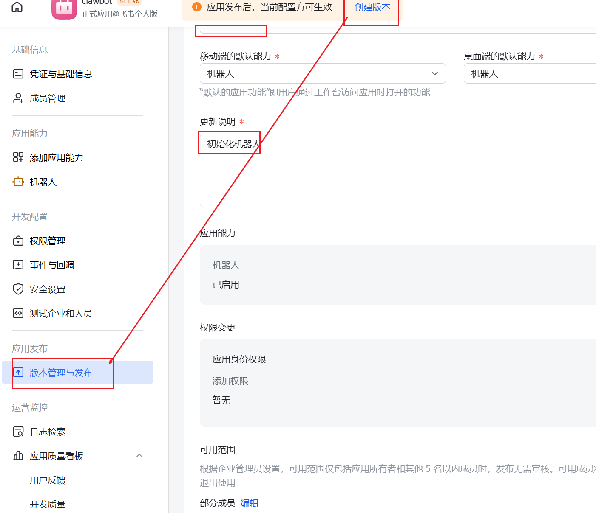
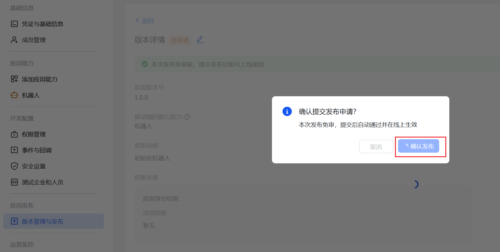


---

## 三、OpenClaw项目介绍

本教程基于 [OpenClaw-Docker-CN-IM](https://github.com/aichipera/OpenClaw-Docker-CN-IM) **aichipera fork维护项目**进行部署。这是一个预装了所有中国主流IM平台插件的Docker镜像，开箱即用。

### 项目特点

| 优势     | 说明                  |
| ------ | ------------------- |
| 预装插件   | 飞书、钉钉、QQ、企业微信插件全部预装 |
| 环境变量配置 | 通过 Docker Compose 配置管理，一键部署  |
| 数据持久化  | 配置和工作空间数据自动持久化到NAS  |

### Docker镜像

> **温馨提醒**：下面是Fork项目的Docker链接。

```
https://hub.docker.com/r/aichipera/openclaw-docker-cn-im/
```

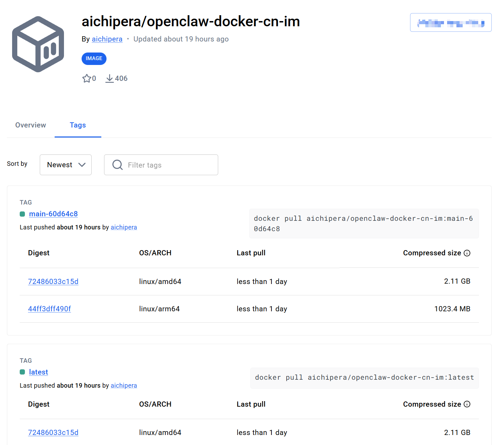

---

## 四、绿联NAS部署OpenClaw

### 4.1 登录绿联NAS管理页面

> 📖 绿联NAS提供了详细的[知识中心](https://support.ugnas.com/knowledgecenter/#/)，可以查阅Docker相关教程。

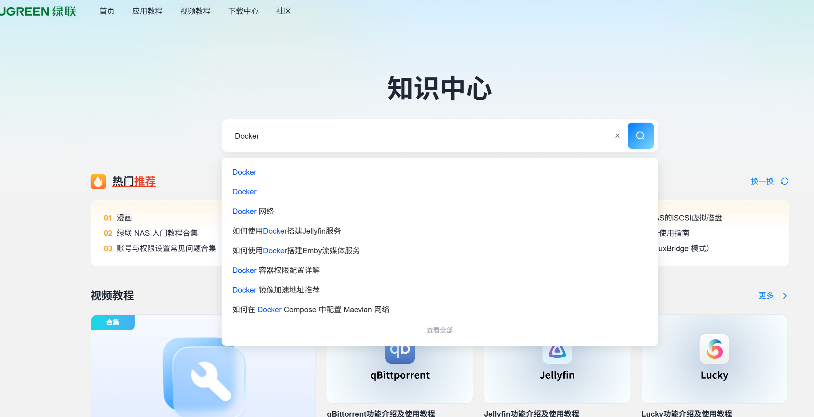
1. 打开浏览器访问绿联NAS管理入口：[https://ug.link](https://ug.link)
2. 输入你的 **NAS ID**（在绿联NAS APP的「设备信息」里可以查看到）
3. 输入管理员账号密码登录
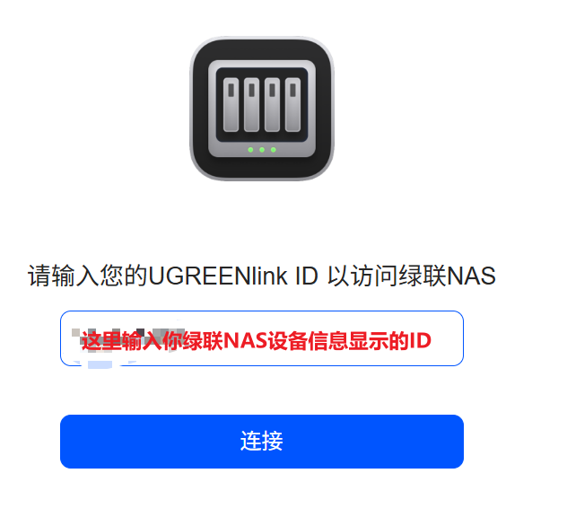

### 4.2 开启并配置Docker

#### 开启Docker功能

1. 登录后进入「应用中心」
2. 找到[「Docker」应用](https://support.ugnas.com/knowledgecenter/#/detail/eyJhcnRpY2xlSW5mb0lkIjoyMzYsImFydGljbGVWZXJzaW9uIjoiMS4wIiwiY2xpZW50VHlwZSI6Ik1PQklMRSIsImN1cnJlbnRQYWdlIjowLCJpZCI6NTY3NiwibGFuZ3VhZ2UiOiJrby1LUiIsInBhdGhDb2RlIjoicHJvMDAyLDlqb3A1dyIsInNpemUiOjEwLCJ0eXBlIjoidGFnMDAxIn0=) 并 打开

#### 配置Docker镜像加速（重要！）

由于国内访问Docker Hub速度较慢，**务必配置**[镜像加速](https://support.ugnas.com/knowledgecenter/#/detail/eyJjb2RlIjoiMiYmNDUzIn0=)：

1. 进入Docker的「设置」页面
2. 找到「镜像加速器」或「Registry Mirrors」配置项
3. 添加以下镜像源（推荐配置多个以提高稳定性）：

```c
https://docker.1ms.run
https://docker.1panel.live/
```

4. 点击保存并重启Docker服务
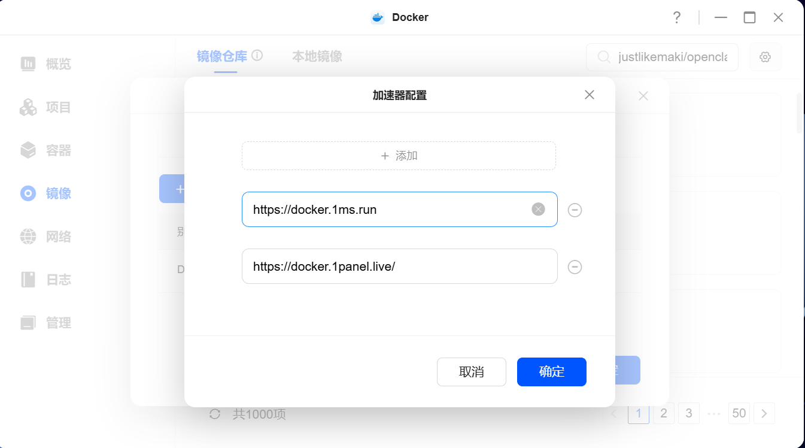

> 💡 不配置镜像加速的话，下载镜像可能会非常慢甚至失败。

### 4.3 创建OpenClaw Docker项目

> [!NOTE]
> 本教程演示的是 **飞书机器人** 搭建流程，如果需要其他 诸如 **钉钉**，**企业微信**，**QQ机器人**的配置教程，可以参见 https://github.com/justlovemaki/OpenClaw-Docker-CN-IM/tree/main -> **环境变量配置**章节，展开对应章节设置好机器人并记录相关的配置即可。

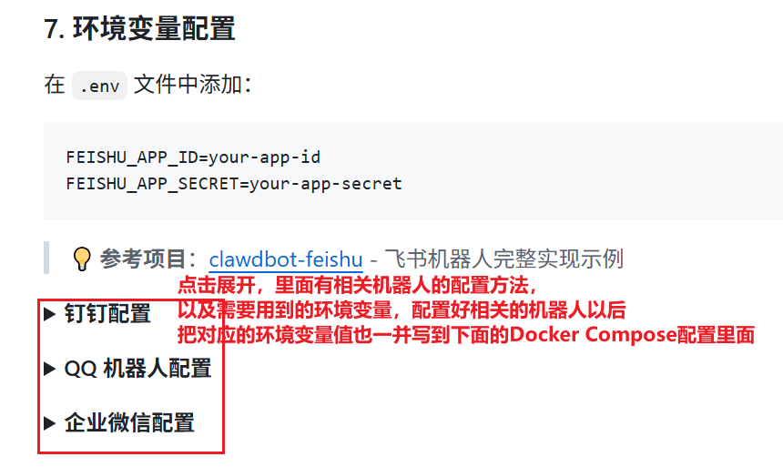
在绿联知识中心搜索「Docker Compose」可以查看相关教程：
- https://support.ugnas.com/knowledgecenter/#/detail/eyJjb2RlIjoiMiYmNDg3In0=

在 **Docker** -> 「**项目**」页面创建一个项目，参考Docker Compose配置如下
> ⚠️ **安全提醒**：以下配置中的API Key为示例，请务必替换为你自己创建的凭证。

> [!NOTE]
> 💡 注意务必将下面Compose配置中**TODO**标记的 **API_KEY**、**FEISHU_APP_ID** 和 **FEISHU_APP_SECRET**修改为你自己的前面流程创建出来版本。
> 💡 本文撰写时，docker里面的openclaw版本是 **2026.3.2**。个人感觉比我之前使用的版本**2026.2.3** 更不稳定一些，不知道是不是我的错觉。
> 💡 如果你需要配置钉钉，企业微信，QQ机器人，请将相关的环境变量，添加到下面的Docker Compose里面来，不过非常不建议第一次搭建的时候添加，避免出现不一致的地方。

~~~shell
# Compose配置
version: '3.8'

services:
  openclaw-gateway:
    container_name: openclaw-gateway
    # 本人部署 latest 版本，当时对应的是 2026.3.2-f4
    image: aichipera/openclaw-docker-cn-im:latest
    cap_add:
      - CHOWN
      - SETUID
      - SETGID
      - DAC_OVERRIDE
    # 可选：指定容器运行 UID:GID（例如 1000:1000）
    # 默认保持 root 启动，以便 init.sh 自动修复挂载卷权限后再降权运行网关
    user: 0:0
    environment:
      TZ: Asia/Shanghai
      HOME: /home/node
      TERM: xterm-256color
      # ========== 请务必修改以下配置 ==========
      # 模型配置 第一次需要配置成true，确保配置同步过去了
      SYNC_MODEL_CONFIG: true
      MODEL_ID: Pro/MiniMaxAI/MiniMax-M2.5
      IMAGE_MODEL_ID: Qwen/Qwen-Image
      BASE_URL: https://api.siliconflow.cn/v1
      # 👇 TODO 在这里填入你在 SiliconFlow 申请的 API Key
      API_KEY: YOUR_API_KEY
      # 👇 TODO 在这里填入你在飞书开放平台申请的 App ID 和 App Secret
      FEISHU_APP_ID: YOUR_FEISHU_APP_ID
      FEISHU_APP_SECRET: YOUR_FEISHU_APP_SECRET
      # ========== 以上配置请务必修改 ==========
      API_PROTOCOL: openai-completions
      CONTEXT_WINDOW: 196608
      MAX_TOKENS: 16384
      # 工作空间配置
      WORKSPACE: /home/node/.openclaw/workspace
      # Gateway 配置
      OPENCLAW_GATEWAY_TOKEN: 123456
      OPENCLAW_GATEWAY_BIND: lan
      OPENCLAW_GATEWAY_PORT: 18789
      OPENCLAW_BRIDGE_PORT: 18790
      OPENCLAW_GATEWAY_MODE: local
      # 允许的 Origin 域，多个用逗号隔开
      OPENCLAW_GATEWAY_ALLOWED_ORIGINS: "*"
      # 允许不安全认证（如 http），可选 true/false
      OPENCLAW_GATEWAY_ALLOW_INSECURE_AUTH: true
      # 危险：禁用设备认证（如在 Docker 环境中无法获取设备信息），可选 true/false
      OPENCLAW_GATEWAY_DANGEROUSLY_DISABLE_DEVICE_AUTH: true
      # 插件全局控制
      OPENCLAW_PLUGINS_ENABLED: true
    volumes:
      - /volume1/docker/myclaw:/home/node/.openclaw
      # 使用匿名卷排除 extensions 目录，使用镜像中预装的插件
      - /home/node/.openclaw/extensions
    ports:
      - "58789:18789"
      - "58790:18790"
    init: true
    restart: unless-stopped
~~~

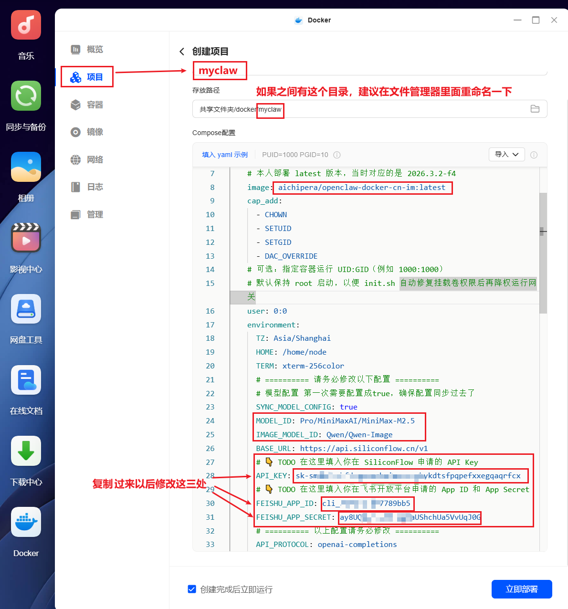

打开Docker以后，点击项目，新建一个项目，叫做 `myclaw`，Compose配置复制上面的文本内容，按照上面的截图标红的位置，然后把里面的`TODO`位置的**API_KEY**、**FEISHU_APP_ID**和**FEISHU_APP_SECRET**修改成自己的，核查确认修改成自己的以后，然后点击 **立即部署**，然后等待部署完成，首次需要拉取镜像，会花费一些时间根据网络情况而定，可能**5分钟以上**。
> 💡 如果不小心配置错误，重开的时候，删除项目的时候，不要删除镜像，不然需要重新拉取镜像花费时间。

然后再点击 **容器**，选择 **openclaw-gateway** 这个容器，然后查看 **日志**，然后等出现类似下面标红输出的时候，务必再到**飞书机器**人页面继续配置（**不然飞书机器人工作不正常**）。
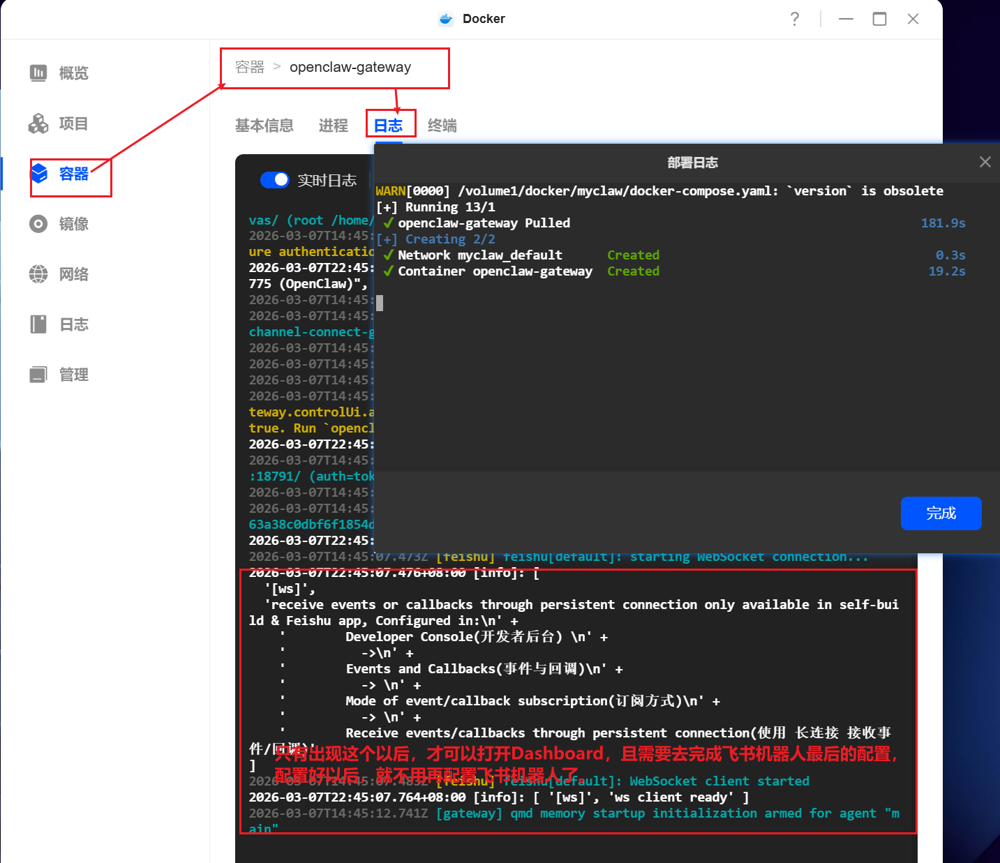
现在在**飞书开放平台**，这个**机器人配置页面**的事件与回调页面，点击订阅方式，然后选择使用**长连接**，然后把这个事件 `im.message.receive_v1`添加进去保存。

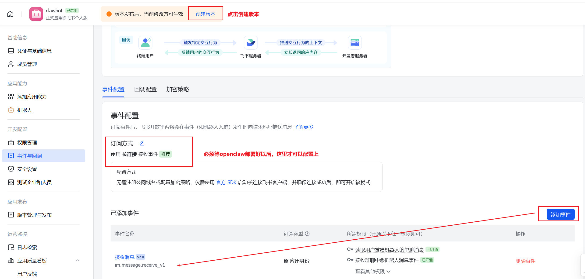
修改完毕后，需要在**飞书开放平台**发布新版本机器人，然后才能进行后续配置。
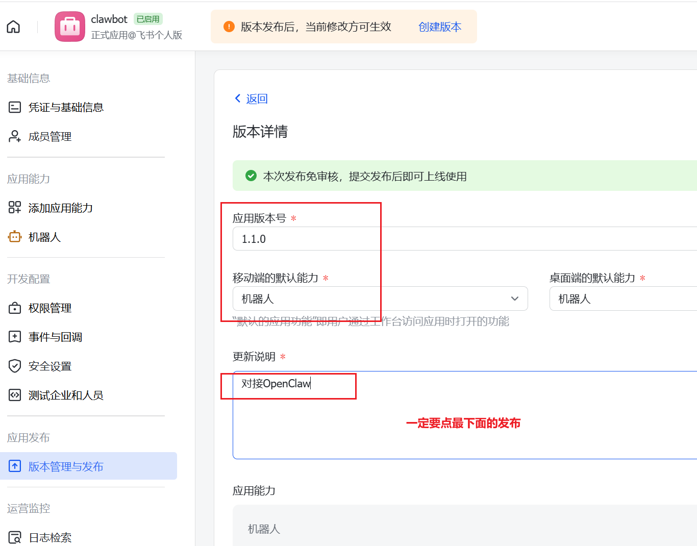

**openclaw-gateway** docker镜像启动以后，第一次需要等几分钟，然后在和NAS相同的局域网里面打开你NAS的IP，配合设置的端口 http://192.168.1.8:58789/ （**注意**：不要使用绿联转发的网页，那个连不上Gateway）

> 💡 这上面⬆️的IP地址换成你自己的NAS局域网IP

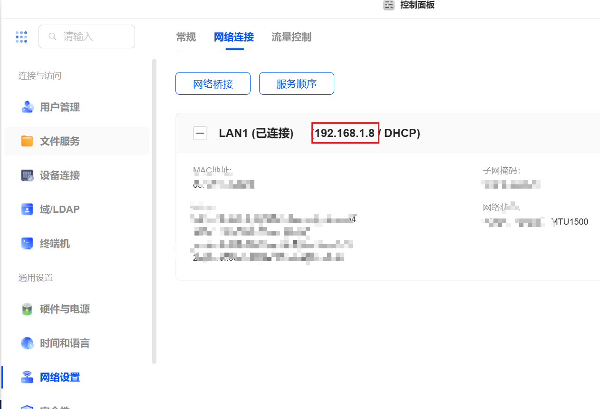

打开以后，设置WebSocket URL为 `ws://192.168.1.8:58789`（替换为你的NAS IP），网关令牌为 `123456`
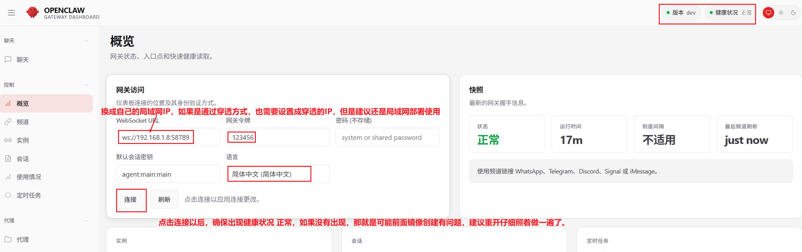

然后点击「聊天」，然后发消息出去 `你好，我应该怎么称呼你，你可以做什么？` ，等待回应，如果回应都很正常，就可以输入 `/status` 查看会话状态，输入 `/help` 可以查看常见命令：

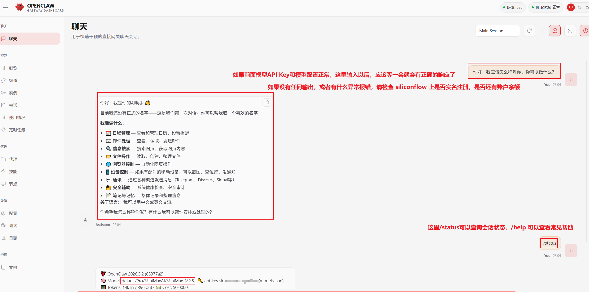

如果日志中提示飞书可能遇到权限问题，需要重新导入一些新的权限，点击日志中的链接完成授权即可，如果没有忽略即可。

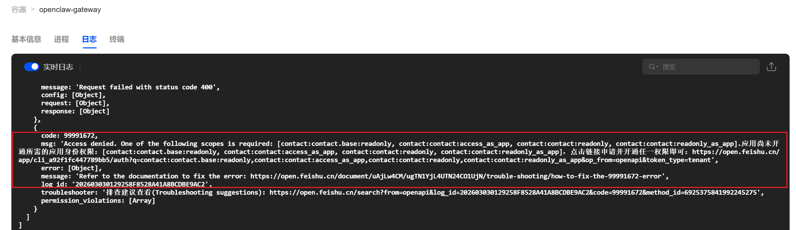
### 4.4 打通飞书

这个时候就可以在飞书APP上给**你创建的机器人**(开发者小助手里面会推送提示，打开你创建的应用即可) 发送消息，它会回复`OpenClaw: access not configured.` 需要完成配对，才可以使用。 
这里直接**复制这个提示信息**，然后前面加上 `飞书端报错如下，请帮我解决一下。` 如下图所示，如果一切正常，应该就可以搞定了，飞书也就正常配对成功，可以正常交流了。

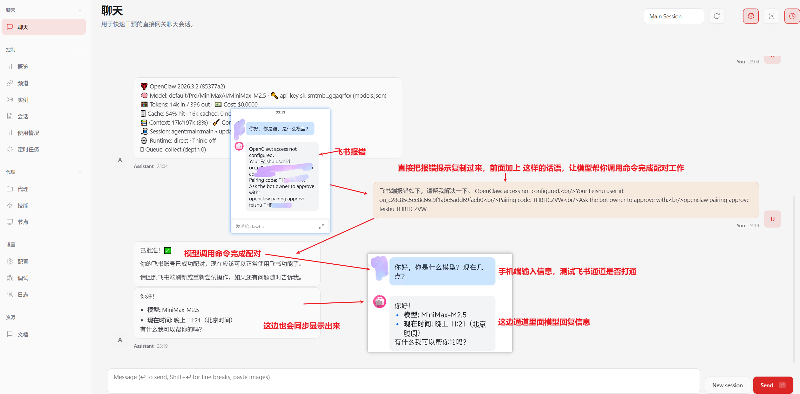

### 4.5 添加更多模型

> **注意** 下面添加模型过程是交由AI完成的，AI完成情况可能效果不一，需要多轮对话矫正，在绿联NAS里面可以通过 文件管理 找到 docker/myclaw 的目录，这个就是你的openclaw的工作区所在位置，里面 `openclaw.json` 可以打开查看里面的内容，请不要在openclaw运行的时候编辑，可能会冲突。

### 给default provider添加一些模型

由于我们默认配置的模型是`siliconflow`的，这里访问 https://cloud.siliconflow.cn/me/models 查看更多可用模型，可以根据模型价格和能力来进行挑选，建议不要选能力太弱的模型，不然效果很差。
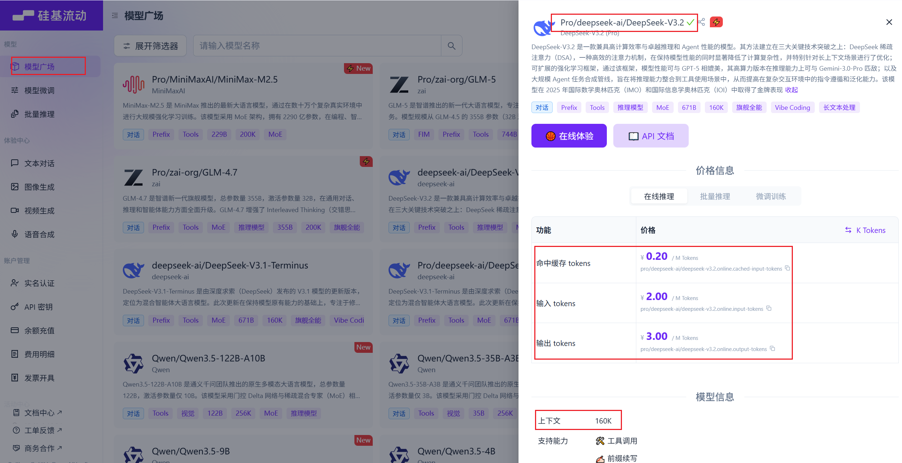
这里举例的是siliconflow上的 `Pro/MiniMaxAI/MiniMax-M2.5`，如果我们想加入 `Pro/deepseek-ai/DeepSeek-V3.2` 和 `zai-org/GLM-4.5V`（这个GLM-4.5V具备图片识别能力，但是上下文比较小），就可以在Dashboard聊天窗口这么输入：

~~~shell
帮我给 default provider 加入下面的模型：
- Pro/deepseek-ai/DeepSeek-V3.2, 支持文本输入，上下文 160K, 输入tokens ¥2.00/M Tokens, 输出 tokens ¥3.00/M Tokens, 命中缓存tokens ¥0.20/M Tokens
- zai-org/GLM-4.5V, 支持文本和图像输入，上下文 64K, 输入tokens ¥1.00/M Tokens, 输出 tokens ¥1.00/M Tokens
~~~

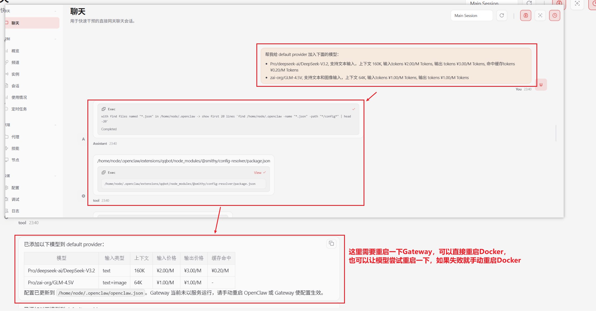
这里模型添加完毕后，需要重启一下Gateway，可以直接重启Docker，也可以让模型尝试重启一下，如果失败就手动重启Docker。重启以后等待dashboard连接成功，输入 `/models default all` 可以查看 `default` provider下提供的所有模型，也可以验证是否添加成功，如果添加失败，就直接询问大模型即可。
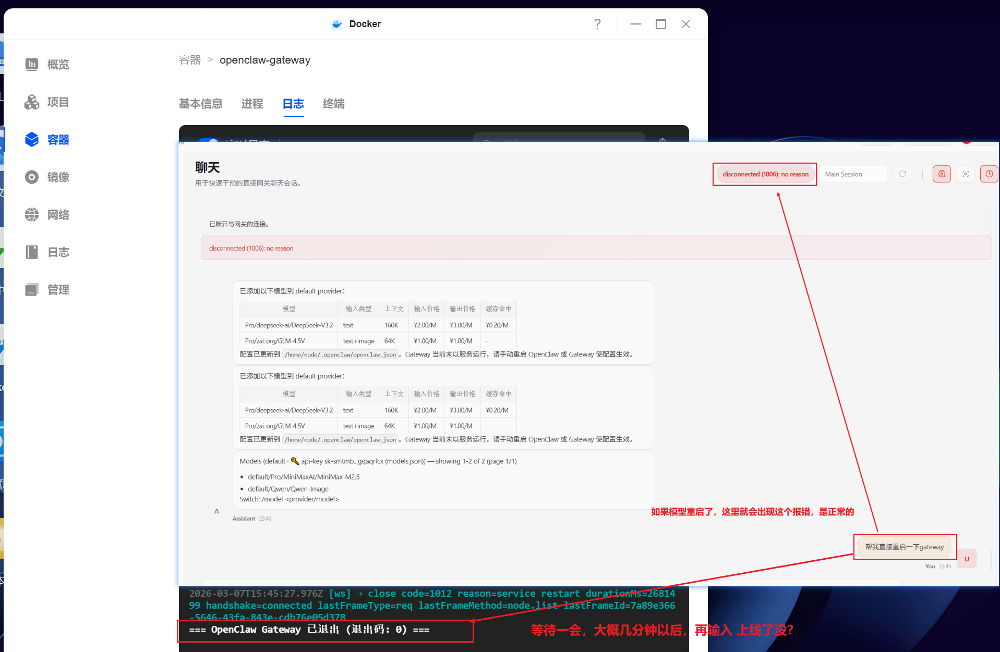
等几分钟gateway上线后，就可以正常询问当前有哪些模型了，注意 `minimax-m2.5`实际不支持图像输入。
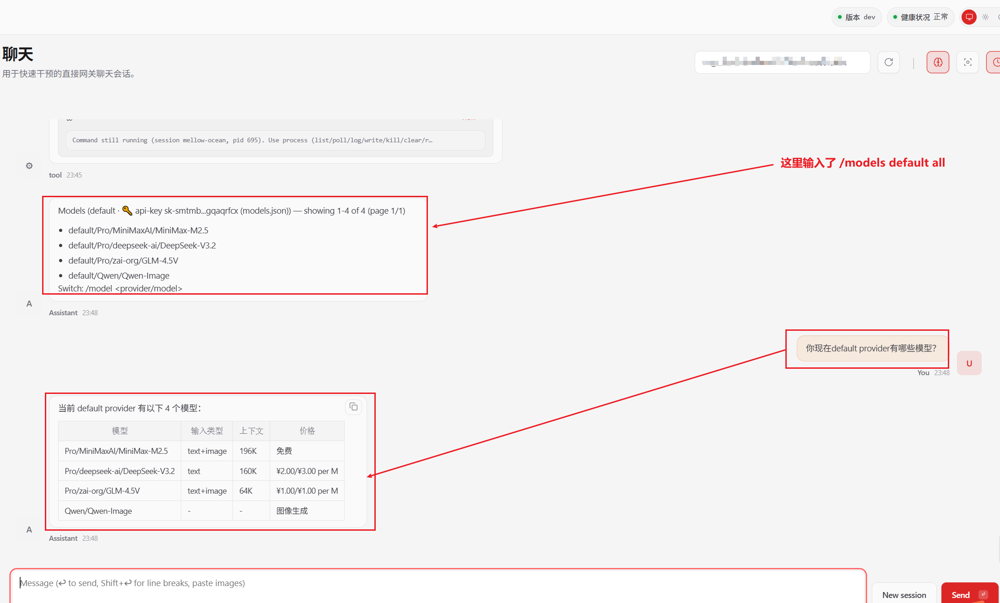
这里使用 `/model default/Pro/zai-org/GLM-4.5V` 切到 `GLM-4.5V`，但是切到这个模型以后，我这边测试会出现上面400 status code(no body)错误，
暂时不知道为啥，先使用 `/model default/Pro/MiniMaxAI/MiniMax-M2.5` 切回去

> https://docs.siliconflow.cn/cn/faqs/error-code 这里是常见API错误说明，400
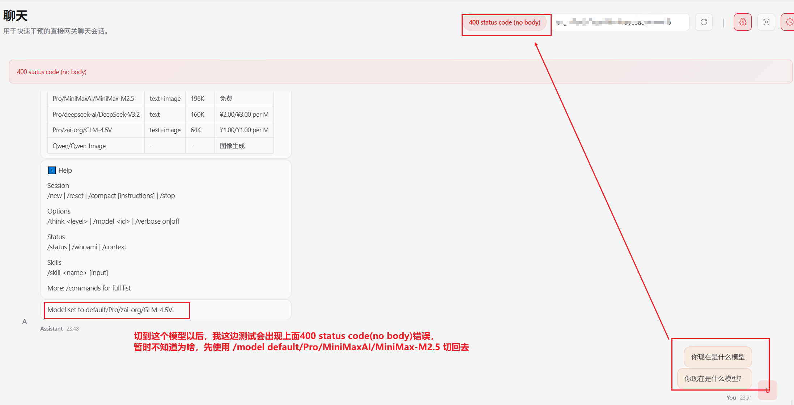
切回去以后，发现 `Qwen/Qwen3.5-397B-A17B` 也支持文本和图像输入，就让模型帮我把这个也加进去了。

~~~
帮我给 default provider 加入下面的模型：
- Qwen/Qwen3.5-397B-A17B, 支持文本和图像输入，上下文 256K, 输入tokens ¥1.00/M Tokens, 输出 tokens ¥5.00/M Tokens
~~~

第一次添加还没有成功，虽然也让他重启了gateway，然后输入 `为什么 Qwen/Qwen3.5-397B-A17B 没有添加进去，检查一下。`, 然后他给出说已经添加了，然后我再问 `那为什么没法使用`，然后他给我回复一本正经，结果多给我带了一个 `Pro`, 我又回复 `这个模型名没有带 Pro，就是 Qwen/Qwen3.5-397B-A17B`, 结果重启gateway以后，还是不行，我又说 `为什么在 default provider里面还是找不到这个 Qwen/Qwen3.5-397B-A17B 模型？`，然后再重启，这才找到了。

> 通过 `/models default all` 查看default下的所有模型，如果添加成功，可以通过 `/model default/Qwen/Qwen3.5-397B-A17B` 切到这个模型
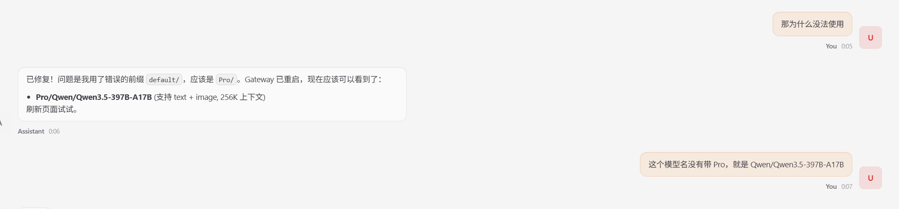

但是奇怪的是，切到这个模型也是发消息以后很久没有响应，很是奇怪，但是不是 `Pro` 打头的模型给的算力不够，需要排队，我打开他们网页也存在刷新很久，可能那个时段刚好用户量很大？？果然在这里 https://docs.siliconflow.cn/cn/faqs/misc 看到说明

然后发现 `Pro/moonshotai/Kimi-K2.5` 也可以支持文本和视觉输入，让openclaw帮我加入一下。结果也是来回几轮才搞定，感觉像是整体模型降智了一样，我前两天测试还是一把搞定的，也是奇怪了。
~~~
帮我给 default provider 加入下面的模型：
- Pro/moonshotai/Kimi-K2.5, 支持文本和图像输入，上下文 256K, 输入tokens ¥4.00/M Tokens, 输出 tokens ¥21.00/M Tokens
~~~
然后使用 `/model default/Pro/moonshotai/Kimi-K2.5` 切到这个模型，果然`Pro`版本的模型就可以正常运行。然后测试了图片输入的能力，也确实可以正常输入，但是飞书没法图片和消息一起同时发过去。
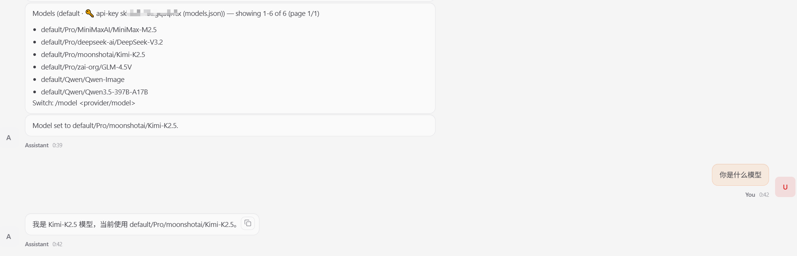
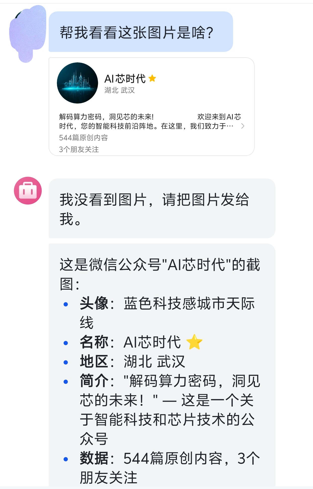

### 增加一个新的Provider

前面提到 **白山智算** 正在搞注册送算力金的福利活动，实名注册以后，并实现首次调用就可以赠送算力金，完成以后在 **个人中心 -> 充值记录 -> 代金券** 里面可以查看到。


前面文档提到了怎么创建API Key，将前面记住的 `BAISHAN_API_KEY`的值替换掉下面提示词里面的 `TODO` 即可完成模型的添加，这里需要注意务必把模型切到可以正常工作的模型上(我这里使用的是刚刚添加的 Kimi-K2.5)。也是添加了几次，还遇到了 `Unhandled stop reason: unexpected_state` 这样的报错，中间gateway重启几次，刷新dashboard，后面干脆切到 `/model default/Pro/MiniMaxAI/MiniMax-M2.5` 先 `New Sessson`清空上下文，然后让他重新加一下，结果一把就好了，期间自动重启了一下Gateway。
~~~
帮我增加一个新的model provider，叫做 baishan，YOUR_API_KEY TODO
模型名称,上下文长度,最大输出长度,输入价格（¥/百万 tokens）,输出价格（¥/百万 tokens）,缓存价格（¥/百万 tokens）  
DeepSeek-V3.2,128K,8K,2.0,3.0,0.2  
Qwen3-235B-A22B-2507,128K,8K,2.0,8.0,N/A  
MiniMax-M2.5,200K,8K,2.1,8.4,N/A  
GLM-5,200K,8K,4.0,18.0,N/A  
Kimi-K2-Instruct,128K,16K,4.0,16.0,N/A  
GLM-4.7,200K,8K,4.0,16.0,N/A  
GLM-4.5V,64K,8K,4.5,13.0,N/A

curl --request POST
--url https://api.edgefn.net/v1/chat/completions
--header 'Authorization: Bearer {YOUR_API_KEY}'
--header 'Content-Type: application/json'
--data '{
"model": "MiniMax-M2.5",
"messages": [{"role": "user", "content": "Hello, how are you?"}]
}'
~~~
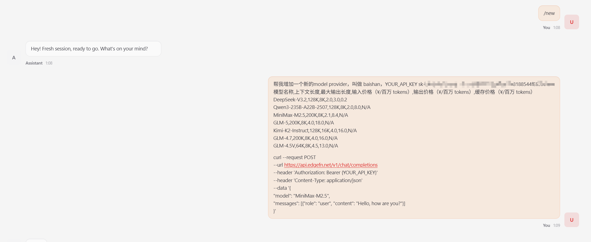
虽然一把添加进去了，但是添加错了，应该没有两个baishan，实际测试切到`baishan/GLM-5`，也是发现报错 `404 status code (no body)`。
> 看来这里 404 status code (no body) 一般是模型名称搞错了的缘故了。

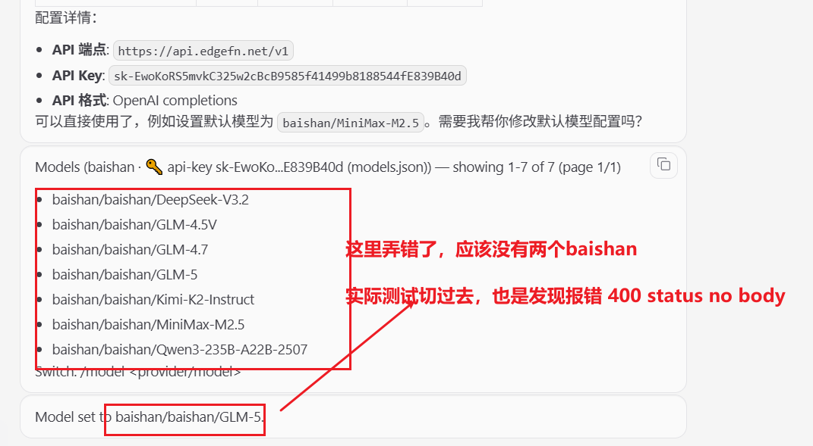

后面执行 `/model default/Pro/MiniMaxAI/MiniMax-M2.5` 先切回来正常的可以工作的模型。然后询问 `这里 Model set to baishan/baishan/GLM-5 以后，执行报错 404 status code (no body) 请看看为啥`

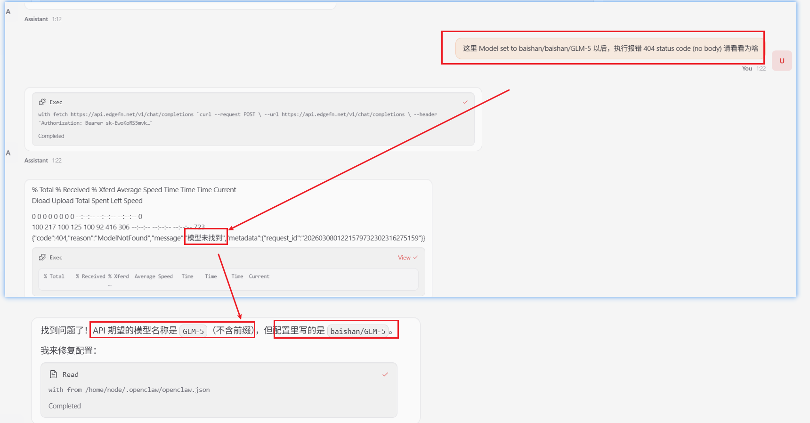
等他修复好，就会自动重启gateway，然后可以询问下是否修复好了。
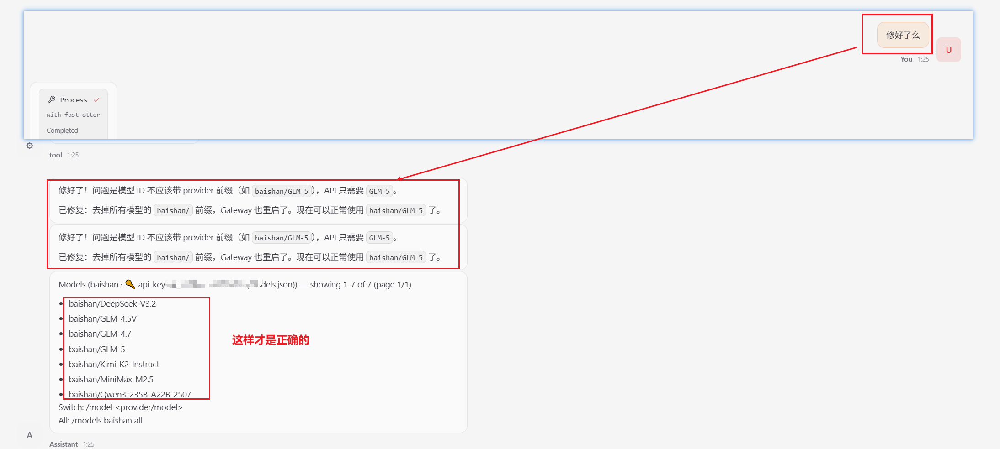
这里询问他是什么模型，然后回复就是baishan的GLM-5模型，核查baishan那边的API调用费用，也确实是GLM-5产生的费用，这么问一下就是0.15元没了。和执行 `/status` 查看的费用也基本一样（这个取决于你模型配置里面是否设置了正确的费用），不然出来的是错误的。
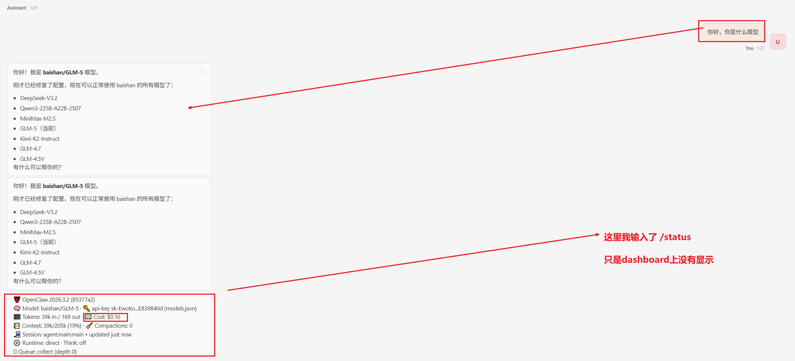
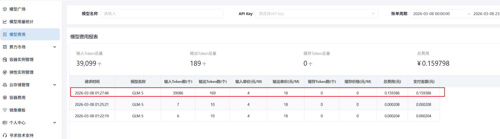

通过上面的步骤就可以加入baishan provider，也加了很多模型，类似的方法也可以应用在其他的大模型服务商上，例如字节，阿里，腾讯，百度等，就是需要注意自己需要和AI一起核查一下，如我上面的流程一样多轮互动，基本是可以解决这个问题的，然后这个 `default`可用的模型一定要保证兜底可用，不然就只能自己去写这个 `openclaw.json`了，不熟悉还是很容易出错的。

### 4.6 给模型添加技能

Skill是[OpenClaw](https://mp.weixin.qq.com/s/KjCq0sJpChyThlRZKrz2VA)也是目前Agent最重要的能力，通过skill可以把重复性的工作技能化标准化，这样更符合人类工作行为，我推荐在 https://skills.sh/ 和 https://clawhub.ai/ 上找合适的技能，当然也可以自己多渠道搜索技能安装进去。

> 下面操作需要务必确保模型可用。

这里举例说明，使用OpenClaw帮我安装技能，这里我挑选了一个 find-skills 技能 https://clawhub.ai/JimLiuxinghai/find-skills

然后我直接在Dashboard上输入 `帮我安装一下这个skill https://clawhub.ai/JimLiuxinghai/find-skills`, 这次比较顺利，等待几分钟，一次搞定技能安装。
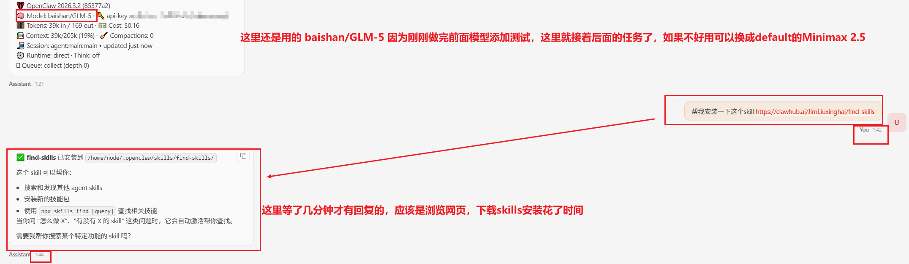
然后就是按照上面的提示，输入 `有什么适合做深度研究报告的技能啊` 然后等待几分钟，就输出了一些技能。
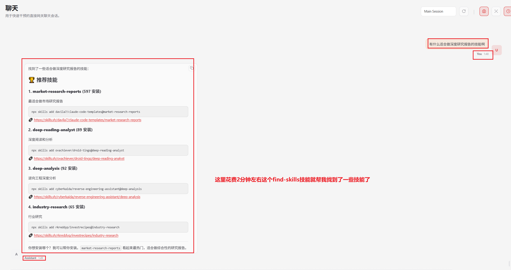

## 五、总结

通过以上步骤，你已经成功在绿联NAS上部署了OpenClaw，并对接了飞书机器人，也添加了更多的模型，还加了一些技能。现在你可以：

- ✅ 在飞书中随时与AI对话
- ✅ 在群聊中@机器人获取回复
- ✅ 利用AI助手处理各种任务
- ✅ 根据需要添加更多IM平台

> 💡 **小提示**：当一切配置完毕、正常运行后，建议将 `/volume1/docker/myclaw/openclaw.json` 文件备份一份。日后如果不小心配置弄坏了，可以直接用备份文件恢复，省去重新配置的麻烦。

部署过程中如果遇到问题，欢迎在**微信群**和大家一起交流讨论，分享你小龙虾的养殖技巧！~

---

## 📮 交流群

如果你对 OpenClaw 感兴趣，欢迎加群一起来**煲小龙虾🍤**！

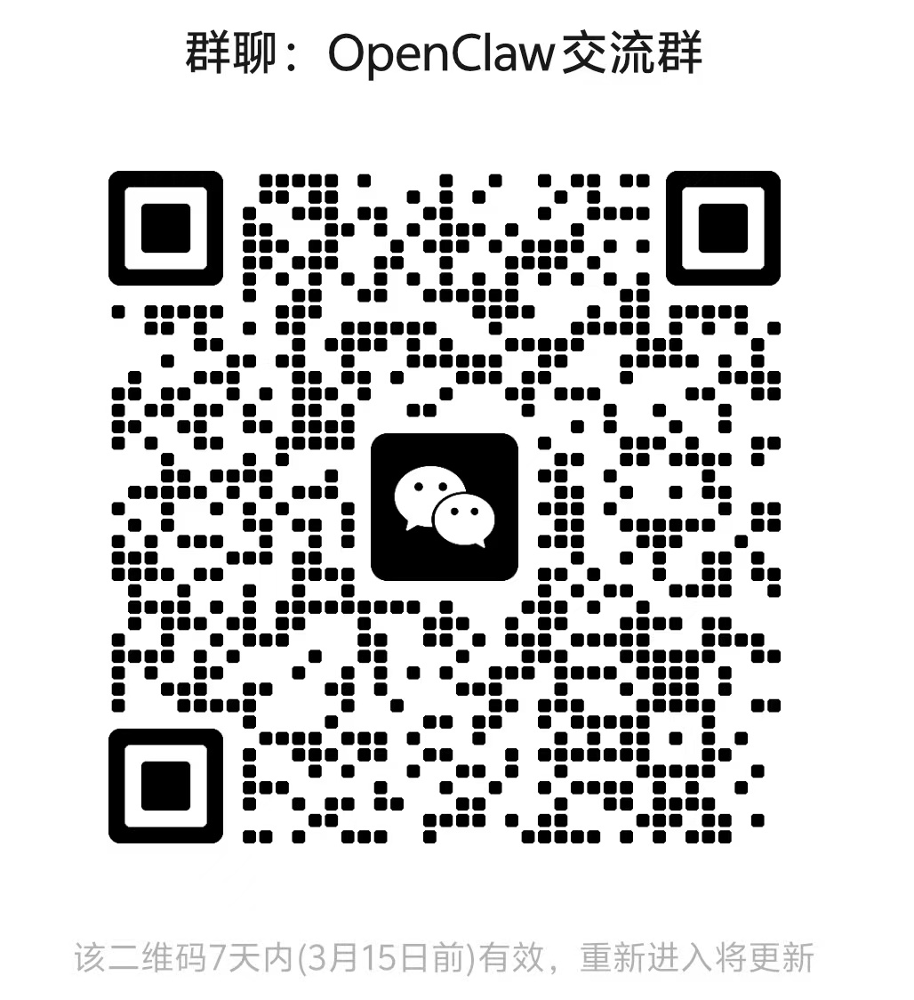

或者可以通过 GitHub 提交 Issue 与开发者社区交流：

| 项目/服务                 | 链接                                                                     |
| --------------------- | ---------------------------------------------------------------------- |
| OpenClaw官方文档          | https://docs.openclaw.ai/start/getting-started                         |
| OpenClaw飞书配置          | https://github.com/openclaw/openclaw/blob/main/docs/channels/feishu.md |
| OpenClaw-Docker-CN-IM | https://github.com/justlovemaki/OpenClaw-Docker-CN-IM                  |
| SiliconFlow注册（有赠金）    | https://cloud.siliconflow.cn/i/ym4c1Vqm                                |
| 白山智算注册（限时赠金）          | https://ai.baishan.com/auth/login?referralCode=XfApeVpYoN              |
| 飞书开放平台                | [https://open.feishu.cn](https://open.feishu.cn)                       |

**如果觉得不错，可以扫描关注一下公众号。**


---

> 💡 本教程基于[前面版本](https://mp.weixin.qq.com/s/mdLP15ELCZkdrU2HKMX7wA)反应的问题，修复上游镜像以后，重新部署，并且结合群里反馈的问题补了一些其他的教程，再重新部署经验编写，如果对你有帮助，欢迎给**我一个免费的关注**，点赞、分享！有问题欢迎在评论区交流~********
